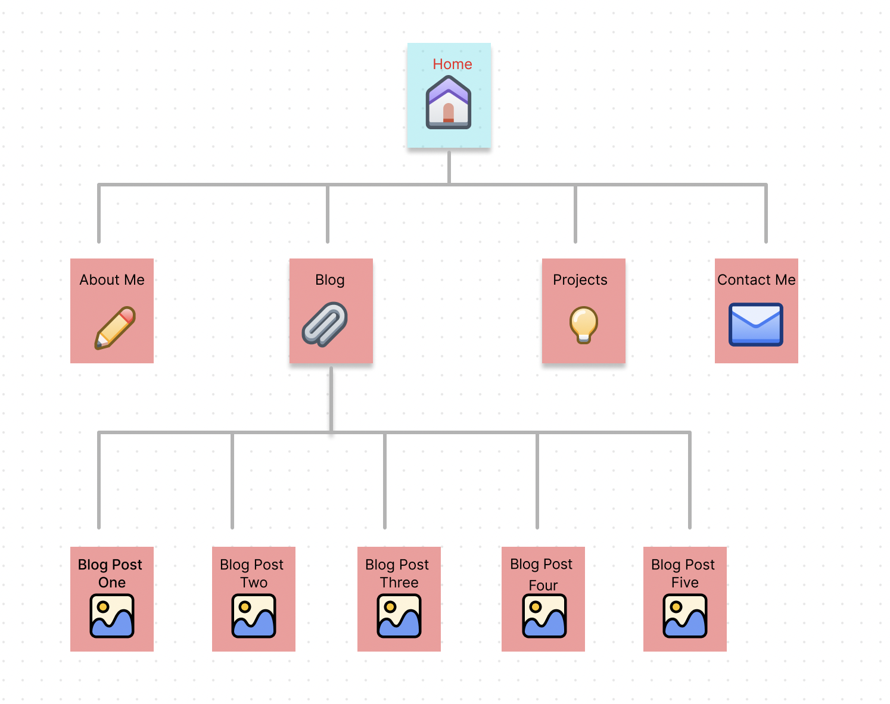
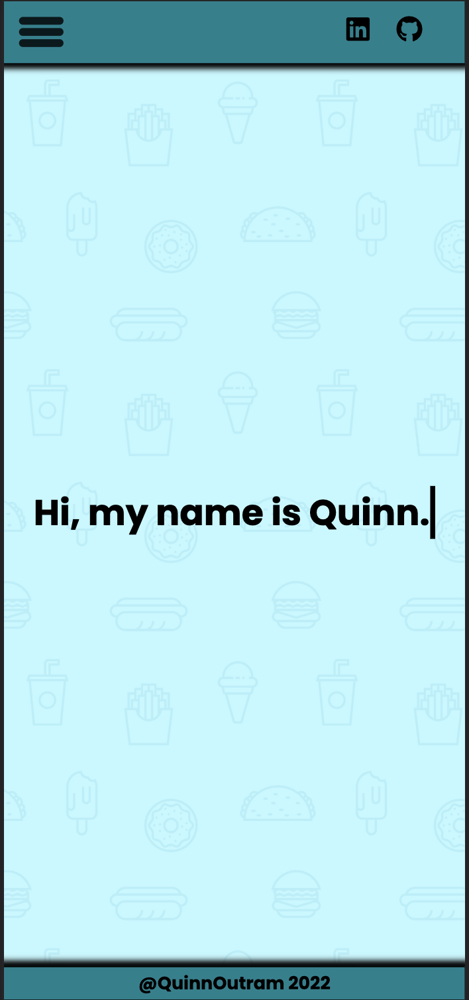
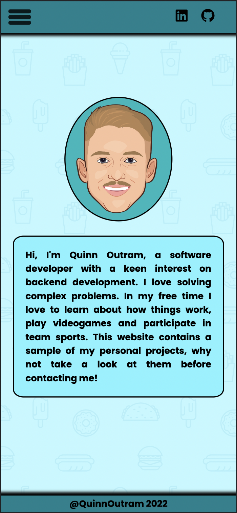
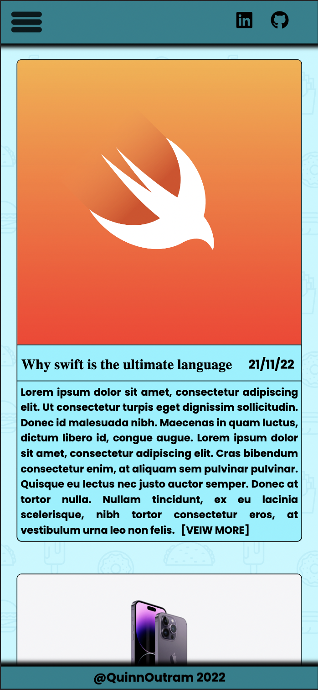
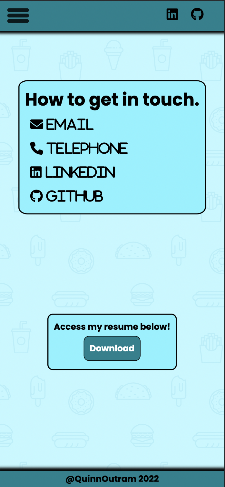
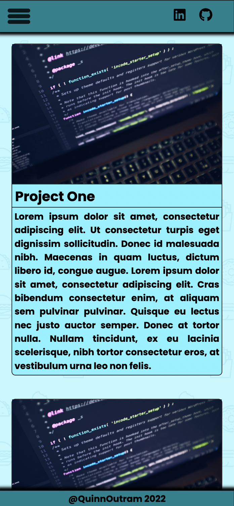

# My portfolio website 

click to access <a href="https://frabjous-churros-a13eb7.netlify.app">here</a>. 

Alternatively a link you can paste in https://frabjous-churros-a13eb7.netlify.app 

or click to access a presentation showing the build process and design decisions <a href="https://youtu.be/HyOg2hTeGrI">here</a>.

Alternatively a link you can paste in https://youtu.be/HyOg2hTeGrI

This websites was built to:  

 - Display competancy with several different technologies including  
    - HTML5
    - Javascript
    - CSS
    - Git
- Provide a platform to display my resume and personal projects for potential companies/recruiters interested in hiring me

Features:  
 - 10 interlinked HTML 5 pages styled with CSS and scripted with JavaScript.
 - A downloadable resume nested alongside my contact details.
 - Interactive links to my professional pages including GitHub and LinkedIn.
 - Annimated elements including a interactive hamburger menu.
 - Personal information about myself

Sitemap
  

Screenshots
 - Homepage(Mobile)  
 
 - About Me Page(Mobile)  
 
 - Blog page(Mobile)  
 
 - Contact page(Mobile)  
 
 - Portfolio page(Mobile)  
 

Target Audience:
 - As this is a portfolio website the primary target is employers and recruiters.

Tech stack:  
 - HTML5
 - CSS
 - JavaScript
 - Git
 - GitHub Pages

Github Repo: https://github.com/quinnoutram/portfolioWebsite

If you have any issues with the website please contact me at quinnoutram1@gmail.com